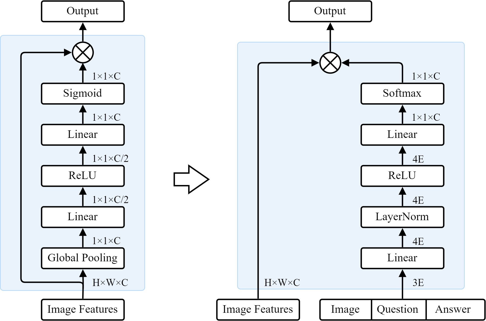
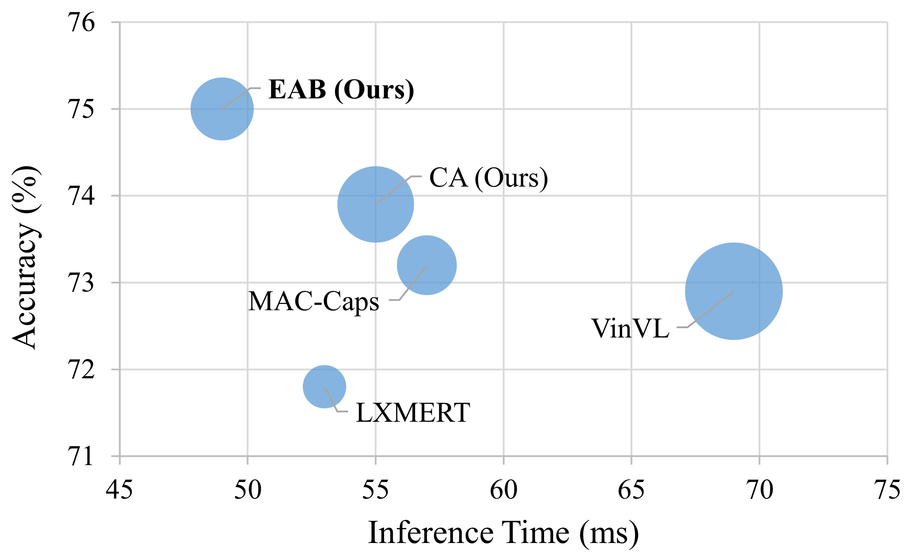
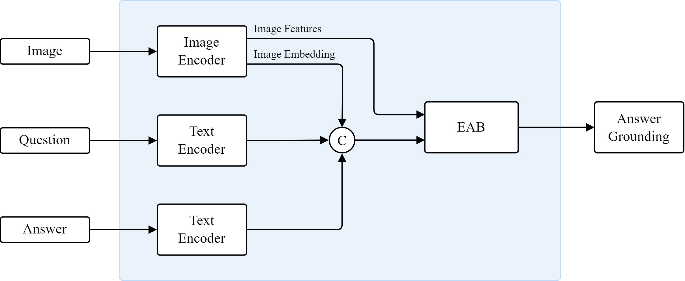
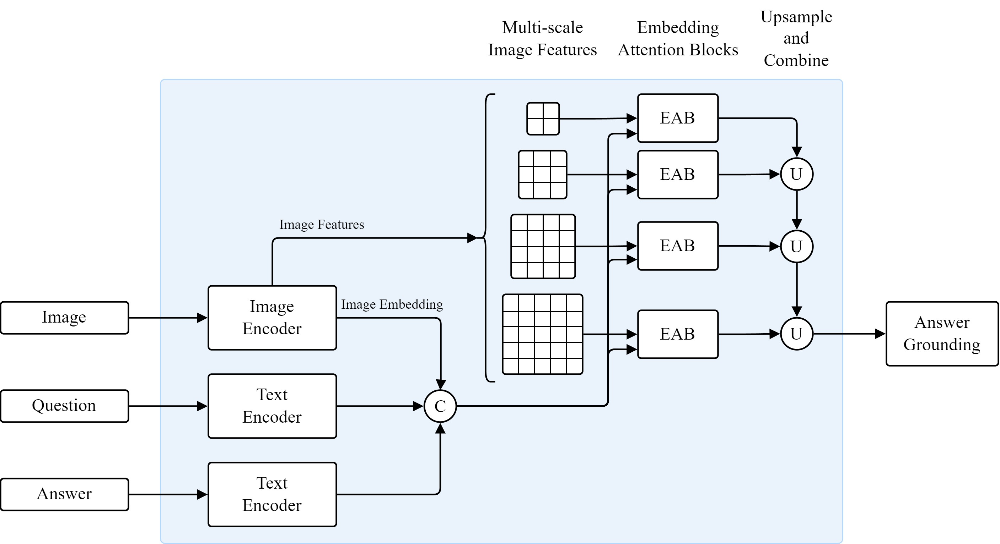

# Embedding Attention Blocks for Answer Grounding
## The IEEE/CVF Conference on Computer Vision and Pattern Recognition 2024

A novel attention module based on the Squeeze-and-Excitation method for the answer grounding task.

<p align="center">

</p>

EAB surpasses others in accuracy while demonstrating the shortest inference time and a moderate average number of parameters.

<p align="center">

</p>

The adaptability of the proposed design allows for seamless integration with both single-scale and multi-scale networks.

|Single-scale|Multi-scale|
|-|-|
|||

## Setup
Install the required modules:
```
pip install numpy matplotlib Pillow torch
```

## Data
### TextVQA-X
Follow the guidance provided in [here](https://github.com/amzn/explainable-text-vqa) to download and set up the TextVQA-X dataset.

### VQS
The VQS dataset along with usage directions, are provided [here](https://github.com/Cold-Winter/vqs).

### VQA-X
Follow [this](https://github.com/Seth-Park/MultimodalExplanations) page to download and set up the VQA-X dataset.

### VizWiz-VQA-Grounding
To download the VizWiz-VQA-Grounding dataset, follow [this](https://vizwiz.org/tasks-and-datasets/answer-grounding-for-vqa/) link.

## Training
The provided code supports training on single and multiple nodes with one or more GPUs.
Run the following command to start the training:
```
python main.py 0
```
where the parameter indicates the node ID.

Other configurations are available in the `config.py` file.

If you find our work useful, please consider citing it:
```
@inproceedings{khoshsirat2023sentence,
  title={Sentence Attention Blocks for Answer Grounding},
  author={Khoshsirat, Seyedalireza and Kambhamettu, Chandra},
  booktitle={Proceedings of the IEEE/CVF International Conference on Computer Vision},
  pages={6080--6090},
  year={2023}
}
```